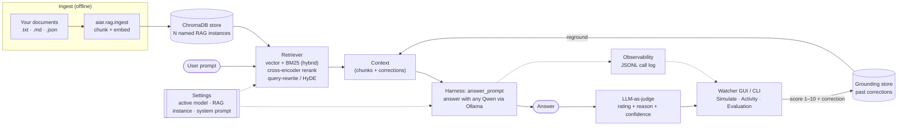

<p align="center">
  
</p>

## ⚡ Quick start: hand this to your AI

New here? Don't read the docs — **copy the block below and paste it into any
capable coding AI agent** (Claude, ChatGPT/Codex, Gemini, Cursor, Copilot Chat,
etc.). It will set up the entire AIAR project for you end-to-end, asking you a
few simple questions (each with a recommended default you can just accept).

````text
You are setting up AIAR ("Artificial Intelligence and RAG") for me on my machine — a small,
open-source, model-agnostic framework for building AND EVALUATING a
retrieval-augmented (RAG) assistant over MY OWN documents, using ANY Qwen model
served locally by Ollama. The full loop is: ingest my docs → retrieve →
answer with Qwen (grounded) → judge the answer 1–10 with a reason → let me
correct it → "reground" so the next answer is fixed. License is Apache-2.0; do
not change the project's code or behavior — only set it up and run it.

Drive the whole setup for me. The authoritative steps live in PLAYBOOK.md in the
repo — follow it. Work step by step, run the real commands, and after EACH step
confirm it actually succeeded (show the relevant output) before moving on. Be
defensive: never assume — check prerequisites first and stop with a clear
explanation if something is missing.
For every step, show:
- the exact command(s) you ran
- the key success output lines
- a short pass/fail statement before moving to the next step
Do not silently batch multiple steps into one end summary.

=== STEP -1: Verify or bootstrap the repo BEFORE asking Step 0 questions ===
First confirm you are in a real AIAR checkout, not just an empty directory or a
bare/partial Git repo. Check the working directory and verify that BOTH
`PLAYBOOK.md` and `config.example` are present there before doing anything else.

If they are missing:
- Show me the exact path you checked and the directory listing.
- Check whether this is just the wrong local path by looking for another nearby
  populated AIAR checkout.
- If you find a populated checkout, tell me the exact correct path and switch to it.
- If the directory only contains `.git`, has no commits, or is otherwise not
  populated, treat it as a broken/incomplete repo bootstrap and FIX IT YOURSELF:
  clone the canonical AIAR repo into that path, using HTTPS by default:
  `https://github.com/wiggins-j/aiar.git`
- If the target directory is unusable for cloning because it already contains an
  empty `.git` directory, remove that broken directory and re-clone cleanly into
  the same path.
- Do NOT stop and ask me for the repo URL unless cloning the canonical repo
  actually fails.
- Only after the repo contents are present and BOTH `PLAYBOOK.md` and
  `config.example` exist should you continue to Step 0.

=== STEP 0: Ask me these configuration questions FIRST ===
Ask me all of these up front. For each, tell me the recommended default and let
me just say "defaults" to accept them all. Then use my answers (or the defaults)
throughout. Set each as an environment variable (see config.example for the
exact names) — AIAR is entirely environment-driven.

1. What hardware will run the model, and which Qwen should I use? — FIRST either
   tell me your specs (total RAM; GPU + VRAM if any; free disk), OR let me
   AUTO-DETECT them: say "scan local" and I'll run the OS-appropriate probe, or
   "scan remote <user@host>" and I'll probe over SSH:
     • Linux:   `free -h` ; `nvidia-smi --query-gpu=memory.total --format=csv` ; `df -h ~`
     • macOS:   `sysctl hw.memsize` ; `system_profiler SPDisplaysDataType | grep VRAM` ; `df -h ~`
                (Apple Silicon shares ONE "unified memory" pool = your RAM)
     • Windows: `systeminfo | findstr /C:"Total Physical Memory"` ; `nvidia-smi` ; `Get-PSDrive C`
   Then I'll recommend the LARGEST Qwen that fits, from the table below, and set
   OLLAMA_MODEL to a tag that actually exists for your Ollama. ANY Qwen works.

   Qwen size → hardware (rough, Q4_K_M quant — VERIFY exact + newest at the URLs below):
     ~1.5B   `qwen2.5:1.5b`              ~2 GB RAM  / ~2 GB VRAM   tiny boxes, smoke tests
     ~3B     `qwen2.5:3b`               ~4 GB RAM  / ~4 GB VRAM   laptops, fast iteration
     ~7–8B   `qwen2.5:7b`, `qwen3:8b`   ~8 GB RAM  / ~6 GB VRAM   balanced default ★
     ~14B    `qwen2.5:14b`, `qwen3:14b` ~16 GB RAM / ~12 GB VRAM  stronger reasoning
     ~32B    `qwen2.5:32b`, `qwen3:32b` ~32 GB RAM / ~24 GB VRAM  workstation / server
     ~72B    `qwen2.5:72b`              ~48 GB+ RAM / 2×24 GB     multi-GPU server
   No GPU? CPU-only runs at every size — just slower; pick one tier below your RAM row.

   ⚠️ ALWAYS check the canonical sources for up-to-date models + exact specs — the
   table above is a SNAPSHOT and will age:
     • Qwen model cards & specs:  https://huggingface.co/Qwen
     • Qwen 3.5 collection:       https://huggingface.co/collections/Qwen/qwen35
     • Qwen 3.6 collection:       https://huggingface.co/collections/Qwen/qwen36
     • Ollama-pullable tags:      https://ollama.com/library/qwen
   The exact tag must exist for YOUR Ollama version — if any tag referenced in this
   repo isn't pullable, substitute the nearest real one from those URLs.
   → sets OLLAMA_MODEL
2. Where should the AIAR checkout live, and should this setup be ISOLATED from
   any existing AIAR/RAG state on that machine? — (recommended: if this is a
   shared server, or if I tell you not to disturb an existing setup, create a
   fresh checkout path such as `~/aiar-isolated` and use isolated runtime paths
   such as `AIAR_BASE_DIR`, `AIAR_DB_PATH`, `GROUNDING_BASE_DIR`,
   `AIAR_LOG_DIR`, `AIAR_QUEUE_FILE`, and `AIAR_VERDICTS_FILE` under a dedicated
   prefix. On a personal/local box with no existing setup to protect, the normal
   repo path + default `~/.aiar` state is fine.)
3. Where is my document corpus (a folder of .txt/.md/.markdown/.rst/.json)? —
   (recommended: pick ONE of these paths up front and use it consistently:
   bundled `./examples/docs` for the small Acme **Example RAG** demo; a full
   Tesla corpus under `corpus/tesla/`; or your own corpus under
   `corpus/<name>/` / another folder you specify.)
4. RAG corpus / collection name? — (recommended: `aiar`.) → sets AIAR_CORPUS
5. Embedding model? — (recommended: `all-MiniLM-L6-v2`, the default.)
   → sets AIAR_EMBEDDING_MODEL
6. How many chunks to inject into each prompt (top-k)? — (recommended: `3`.)
   → sets RAG_TOP_K
7. Enable HYBRID retrieval (dense vectors + BM25)? — (recommended: ON, great for
   exact terms.) → sets RAG_HYBRID_ENABLED=1
8. Enable cross-encoder RERANKER? — (recommended: ON for relevance; first use
   downloads `cross-encoder/ms-marco-MiniLM-L-6-v2` and a wide first pass of
   RAG_FETCH_K=20.) → sets RAG_RERANK_ENABLED=1, RAG_FETCH_K=20
9. Query rewrite / HYDE mode (off | rewrite | hyde)? — (recommended: `hyde`,
   closes the vocabulary gap.) → sets RAG_QUERY_REWRITE_MODE
10. Enable GROUNDING reinjection (auto-apply my past corrections to every
   answer)? — (recommended: ON so corrections stick.)
   → sets GROUNDING_REINJECTION_ENABLED=1
   (Note: the project ships ALL of flags 7–10 defaulting OFF so the bare path is
   plain vector search; we turn them on here for quality. That's expected.)
11. GUI host and port? — (recommended: host `127.0.0.1`, port `8088`, the
    config.example defaults.) → sets AIAR_WEB_HOST, AIAR_WEB_PORT
12. Correction-required score threshold (a score at/below this needs a written
    correction)? — (recommended: `7`.) → sets AIAR_REASON_THRESHOLD
13. Do I also want the optional HTTP harness service (FastAPI)? — (recommended:
    NO for now; the CLI + GUI need none of it. If yes, also
    `pip install -r requirements-service.txt` and run
    `uvicorn aiar.harness.service:app --port 8765`.)
Also note: the store persists at `~/.aiar` (AIAR_DB_PATH / AIAR_BASE_DIR); to
reset everything later, `rm -rf ~/.aiar` (Windows PowerShell:
`Remove-Item -Recurse -Force $HOME\.aiar`).

=== STEP 1: Check prerequisites (do NOT assume) ===
- OS: AIAR is OS-agnostic — Linux (incl. Ubuntu LTS servers), macOS, and Windows
  all work (pure Python + pathlib; no shell scripts, no platform branches).
  Detect mine and use the matching commands throughout (venv activation, paths,
  reset). On a HEADLESS Ubuntu server there's no browser for the GUI — either
  SSH-forward the GUI port (`ssh -L 8088:127.0.0.1:8088 me@server`) or set
  `AIAR_WEB_HOST=0.0.0.0` behind a firewall/tunnel; the CLI needs no GUI.
- Python is 3.10–3.14. On newer active versions, the RAG stack may need to
  build `chroma-hnswlib` from source on some platforms if a wheel is
  unavailable there. Run `python3 --version` (Windows: `py --version`) and
  confirm.
- If I chose `scan remote <user@host>` in Step 0, verify SSH reachability early
  before assuming the remote setup can continue. If SSH is unreachable, stop and
  ask me for a reachable target or a network fix before doing anything invasive.
  If the remote host is reachable by ME but not by YOU from your environment,
  fall back to having ME run the exact probe commands on that host and paste the
  output back to you so you can still size the model and continue safely.
- `ollama` is installed and the server is reachable. If `ollama` is missing,
  tell me how to install it for my OS and have me confirm:
    • macOS:   `brew install ollama` or the .dmg from https://ollama.com/download
    • Linux:   `curl -fsSL https://ollama.com/install.sh | sh`
    • Windows: the installer from https://ollama.com/download (runs as a service)
  Make sure the server is running (`ollama serve &`, the menubar/tray app, or the
  Windows service); `ollama list` should respond.
- Confirm I have enough free disk/RAM/VRAM for the model chosen in STEP 0 (use
  the size→hardware table). If it won't fit, recommend the next tier down.

=== STEP 2: Pull the Qwen model ===
`ollama pull <my model>` (model-agnostic — whatever I chose). Verify with
`ollama list`.

=== STEP 3: Install AIAR ===
From the repo root: create and activate a venv, then install core + RAG stack:
  Use the Python launcher that actually exists on that machine:
  - Linux/macOS: usually `python3`
  - Windows: usually `py`
  - use bare `python` only if it is present and points at the intended version
  <python-launcher> -m venv .venv
  # activate — Linux/macOS:  source .venv/bin/activate
  #            Windows (PowerShell):  .venv\Scripts\Activate.ps1
  #            Windows (cmd):         .venv\Scripts\activate.bat
  pip install -r requirements.txt -r requirements-rag.txt
(`requirements.txt` is the core; `requirements-rag.txt` adds the vector store,
embeddings, BM25, and reranker — install both.) Then export OLLAMA_MODEL and the
other config vars from STEP 0 (you can `source config.example` and edit, or set
them directly). Confirm `<python-launcher> -c "import aiar"` works.

=== STEP 4: Ingest my documents into the RAG ===
IMPORTANT — run ingest ON THE MACHINE THAT HOSTS THE MODEL + AIAR STORE. Ingest
writes embeddings into the store at AIAR_DB_PATH (default ~/.aiar/knowledge) on
the box where the command runs. If the model + infrastructure live on a server
(a remote/isolated setup, or if I chose `scan remote <host>` in STEP 0), run the
ingest THERE over SSH — not on the laptop — or the vectors land in the wrong
store and the harness/GUI on the host won't retrieve them.
AIAR ingests a folder of documents. Two ways to fill that folder:
  (a) MANUAL — I already have a folder of .txt/.md/.json files.
  (b) AI-DRIVEN — an AI builds the corpus from a "Collection Brief" (see the
      README section "Building your RAG corpus: two ways" +
      examples/corpus-briefs/). If I want this, make me choose explicitly:
      - Tesla full demo: use
        `examples/corpus-briefs/tesla-manual-expert-collection-brief.md`,
        collect the docs into `corpus/tesla/`, then ingest with
        `--instance tesla`.
      - My own domain: use
        `examples/corpus-briefs/collection-brief-builder-prompt.md` to
        interview me, write `briefs/<name>-collection-brief.md`, collect docs
        into `corpus/<name>/`, then ingest with `--instance <name>`.
Preview first (no writes): `python -m aiar.rag.ingest <docs folder> --dry-run`
Then ingest for real: `python -m aiar.rag.ingest <docs folder> --instance <name>`
(Omit `--instance` to use the active `default` instance, which the GUI labels
as **Example RAG**; CLI/API still use the slug `default`. `--category <name>`
adds a metadata tag.) Embeddings persist to `~/.aiar/knowledge`. Confirm chunks
written.

=== STEP 5: Run the harness ===
`python -m aiar.harness "How many days do I have to request a refund?"`
(use a question relevant to MY docs). Show me the answer, the judge verdict
(rating + reason + confidence), and the call_id. Useful flags to mention:
`--no-rag` (blind A/B baseline), `--think` (show reasoning), `--json` (full
result), `--reground` (apply prior corrections), `--top-k N`.
Then show retrieval lift with the A/B runner:
`python -m aiar.eval.runner ./examples/cases.json` (reports RAG-on vs RAG-off
delta; positive = RAG helped).

=== STEP 6: Confirm the quality flags are on ===
Confirm the env vars from STEP 0 (RAG_HYBRID_ENABLED, RAG_RERANK_ENABLED +
RAG_FETCH_K, RAG_QUERY_REWRITE_MODE, GROUNDING_REINJECTION_ENABLED) are set,
then re-run the harness so the reranker model loads and the difference is felt.

=== STEP 7: Launch the watcher GUI ===
`python -m web.server` → open http://127.0.0.1:8088 (or my host/port). It has
four pages: Simulate (run a prompt, see answer + verdict, mark it), Activity
(every logged LLM call, mark any one), Evaluation queue (score 1–10 + correct),
and Settings (switch the active Qwen model, switch the active RAG instance —
including a first-class "No RAG" option, with the bundled Acme demo shown as
**Example RAG** instead of raw `default` — and edit the harness system prompt).
Tell me it's serving and what each page does.

If I'm on a headless Ubuntu LTS box or just don't want a browser, I still want
the non-GUI path covered. The core loop is already CLI-first (`aiar.rag.ingest`,
`aiar.harness`, `aiar.eval.runner`). For watcher-only actions that the CLI does
not expose directly yet (Activity, queue maintenance, live Settings changes),
run `python -m web.server` and use its local JSON API instead:
- `POST /api/simulate`
- `GET /api/activity`
- `GET /api/activity/detail?call_id=...`
- `POST /api/activity/evaluate`
- `GET /api/evaluation/queue`
- `POST /api/evaluation/verdict`
- `POST /api/evaluation/clear`
- `GET /api/models` and `POST /api/models/active`
- `GET /api/rag/instances` and `POST /api/rag/active`
- `GET /api/system-prompt` and `POST /api/system-prompt`
Be explicit that there is no separate first-class CLI for Activity / queue /
Settings today; use the GUI or the watcher JSON API.
If no browser is available, do NOT stop at Step 7 — use these watcher API
endpoints plus the CLI to complete Step 8 and prove the full loop.

=== STEP 8: Verify the full end-to-end loop ===
Walk me through it so I SEE it work:
1. On Simulate, run a prompt with "Use RAG" UNCHECKED so the blind answer is
   likely wrong (e.g. "Is live chat support available on weekends?"). Mark it
   for evaluation.
2. On the Evaluation queue, set a LOW score (e.g. 3) — a Correction box appears
   (required at/below the threshold) — write what the answer SHOULD say, then
   click "Submit + Reground". This writes to ~/.aiar/verdicts.jsonl and the
   grounding store (~/.aiar/grounding/<hash>.json).
3. Back on Simulate, ask the SAME prompt again with "Reground" checked: the
   answer should incorporate my correction (green "Reground: applied" badge) and
   the verdict should move up (e.g. bad → good).
You can also verify from the CLI: run the prompt with `--no-rag`, then again
with `--no-rag --reground`, and show me the second answer reflects the
correction. That's the full loop: ingest → retrieve → answer → judge →
evaluate → reground → verify.

=== FINISH: Summarize ===
When everything passes, give me a short summary of how to use AIAR day to day:
the ingest command for new docs, how to run the harness/A/B runner, how to open
the GUI, how the reground loop works, which env vars control behavior (point me
at config.example), and that `rm -rf ~/.aiar` resets all state.
At the very end, always give me the exact URL to open for the watcher GUI
(`http://127.0.0.1:<port>` or the tunneled/remote URL you set up) and the exact
commands I would rerun next for:
- ingest
- harness
- A/B eval
- watcher GUI
- headless watcher API / `curl` path if no browser is available

=== NEXT STEPS: Explore retrieval-quality methods ===
After the loop works, give me a short **Next Steps** menu: the OPTIONAL quality
methods I can turn on and TUNE to make retrieval better, and invite me to explore
them. Each has a runnable guide in `examples/feature-guides/`:
- Hybrid retrieval (vector + BM25)   -> examples/feature-guides/hybrid-retrieval.md
- Cross-encoder reranker             -> examples/feature-guides/reranker.md
- Query rewrite / HyDE               -> examples/feature-guides/query-rewrite-hyde.md
- Grounding reinjection              -> examples/feature-guides/grounding-reinjection.md
- Top-K (context size)               -> examples/feature-guides/top-k.md
- Measure the lift (A/B + ablation)  -> examples/feature-guides/measure-lift.md
Tell me I can either:
- ask "What is <method>?" (e.g. "What's the reranker?") and you'll EXPLAIN it from
  that guide's "What it is" section, or
- say "Let's set up <method>" (e.g. "Set up the reranker") and you'll OPEN the
  matching guide and run its "Set it up" steps with me, then measure the lift.
Recommend the **reranker + hybrid** as the highest-impact pair to start, and remind
me to MEASURE each change on my own corpus
(`examples/feature-guides/measure-lift.md`) rather than trusting defaults.
Every method is **CLI-first** — env vars plus `python -m aiar.harness` /
`python -m aiar.eval.runner`; the one browser-optional step (recording a grounding
correction) also has a `curl` path via the watcher API — so a headless/SSH user can
do all of this from the command line, no GUI required.
````

---

# AIAR — Artificial Intelligence and RAG

A small, open-source, **model-agnostic** framework for building and *evaluating*
a retrieval-augmented (RAG) assistant on **your own documents**, using **any
Qwen model via [Ollama](https://ollama.com)**.

AIAR gives you the full loop in one repo:

1. **Ingest** a folder of YOUR documents (`.txt` / `.md` / `.json`) into a
   vector store.
2. **Retrieve** with a real pipeline — dense vector search, optional **hybrid**
   (vector + BM25), optional **cross-encoder reranking**, optional query
   rewrite / HyDE.
3. **Answer** a prompt with your Qwen model, grounded in the retrieved context.
4. **Judge** the answer with an LLM-as-judge (rating + reason + confidence).
5. **Simulate / evaluate / reground** through a web GUI: run a prompt, see the
   response, mark it, score it 1–10 with a correction, then click **Submit +
   Reground** to feed evaluated pairs back into a **grounding store** so the next
   answer is corrected.

Nothing here is tied to any application domain — point it at your documents and
go.

## Architecture

The full loop in one repo — ingest, retrieve, ground, answer, judge, reground:



- **Ingest** is offline: your docs → chunks → embeddings in ChromaDB (one or many
  named **RAG instances**; "No RAG" is also selectable).
- **Answer time** retrieves (optionally hybrid + reranked + rewritten), prepends any
  prior **grounding** corrections, answers with your Qwen model, then **judges** it.
- The **GUI/CLI** closes the loop: a low score + correction is written back to the
  grounding store, so the next answer to that prompt is fixed (**reground**).
- **Settings** swaps the active model, RAG instance, and harness system prompt live.

## Why "Artificial Intelligence and RAG"?

Most RAG demos stop at "retrieve and answer." AIAR is about the part that
matters in practice: *measuring whether retrieval and grounding actually made
the answer better*, and *closing the loop* when they didn't.

## Components

| Package | What it is |
|---|---|
| `aiar/rag` | `ingest` (folder → chunks), `store` (ChromaDB), `retriever` (`get_context`), `lexical` (BM25), `fusion` (RRF), `reranker` (cross-encoder), `query_rewrite` (HyDE) |
| `aiar/llm` | `call_ollama` — the only thing that talks to Ollama; model-agnostic |
| `aiar/eval` | `judge` (LLM-as-judge), `scorer` (deterministic rubric), `runner` (RAG-on vs RAG-off A/B) |
| `aiar/grounding` | `store` (corrections keyed by prompt signature), `reinject` (render corrections into the next prompt) |
| `aiar/harness` | `pipeline.answer_prompt` (prompt → retrieve → reground → answer → judge), a CLI, and an optional FastAPI `service` |
| `aiar/observability` | JSONL logging of every LLM call (the GUI tails this) |
| `web/` | the stdlib-only watcher GUI: Simulate / Activity / Evaluation / Settings pages |

## Quickstart

Use the Python launcher that exists on your machine: on many macOS/Linux setups
that means `python3`; on Windows it is often `py`. The examples below use
`python` generically.

```bash
# 1. Pull any Qwen model with Ollama. Pick a tag sized to your hardware; verify
#    it's pullable at https://ollama.com/library/qwen
#    (specs / collections: https://huggingface.co/Qwen ,
#     https://huggingface.co/collections/Qwen/qwen35 ,
#     https://huggingface.co/collections/Qwen/qwen36)
ollama pull qwen2.5:7b          # or qwen2.5:3b (laptops), qwen3:14b (stronger), ...

# 2. Install AIAR + the RAG stack
python -m venv .venv && source .venv/bin/activate   # Windows: .venv\Scripts\activate
pip install -r requirements.txt -r requirements-rag.txt

# 3. Tell AIAR which model to use (the tag you pulled above)
export OLLAMA_MODEL="qwen2.5:7b"                     # Windows: $env:OLLAMA_MODEL="qwen2.5:7b"

# 4. Ingest YOUR documents
python -m aiar.rag.ingest ./examples/docs

# 5. Ask a question
python -m aiar.harness "How many days do I have to request a refund?"

# 6. Launch the GUI (Simulate → mark → evaluate → reground)
python -m web.server      # http://127.0.0.1:8088
```

See **[PLAYBOOK.md](PLAYBOOK.md)** for the complete, copy-paste, end-to-end
walkthrough — including turning on the reranker + grounding flags and verifying
a regrounded answer improved.

If you do not want a browser, the core workflow is already available from the
CLI (`aiar.rag.ingest`, `aiar.harness`, `aiar.eval.runner`). The watcher-only
features (Activity, queue maintenance, live Settings changes) are available via
the watcher server's local JSON API after `python -m web.server`; there is not
yet a separate first-class CLI for those surfaces.

## Building your RAG corpus: two ways

AIAR ingests a *folder of documents*. How that folder gets populated is up to you —
there are two supported paths:

**1. Manual — you gather the documents.** Drop `.txt` / `.md` / `.markdown` / `.rst`
/ `.json` files into a folder and ingest:

```bash
python -m aiar.rag.ingest /path/to/my/docs --instance my-corpus
```

(Omit `--instance` to ingest into the active built-in instance. In the GUI that
instance is shown as **Example RAG**; in CLI/API flags its slug is still
`default`. A new named instance is created on first ingest.)

**2. AI-driven — an AI builds the corpus from a brief.** Write a one-file
**Collection Brief** that tells an AI agent (one with web + file tools) exactly
which sources to use, what's in/out of scope, how to split + tag files, and the
safety rules to respect. Hand the brief to the agent; it fetches and normalizes
documents into a folder; then you ingest that folder with AIAR as above.

Choose one of these paths:

- **Full Tesla demo:** start from
  [`examples/corpus-briefs/tesla-manual-expert-collection-brief.md`](examples/corpus-briefs/tesla-manual-expert-collection-brief.md),
  have the agent collect docs into `corpus/tesla/`, then ingest with
  `python -m aiar.rag.ingest corpus/tesla --instance tesla`.
- **Your own domain/template:** start from
  [`examples/corpus-briefs/collection-brief-builder-prompt.md`](examples/corpus-briefs/collection-brief-builder-prompt.md),
  let the AI interview you and write `briefs/<name>-collection-brief.md`,
  collect docs into `corpus/<name>/`, then ingest with
  `python -m aiar.rag.ingest corpus/<name> --instance <name>`.

- **Worked example:** [`examples/corpus-briefs/tesla-manual-expert-collection-brief.md`](examples/corpus-briefs/tesla-manual-expert-collection-brief.md)
  — an access-respecting Tesla knowledge-base brief built on **open APIs + public
  data** (NHTSA, vPIC, EPA fuel-economy, NREL charging, GDELT news, SEC) plus tiered
  review/forum/sales sources with trust handling. Tesla's own sites block automated
  agents (403 / auth-gated) and are excluded — never bypass bot protection. Includes
  verified endpoints, safety classes, metadata schema, and eval questions.
- **Generate your own:** paste [`examples/corpus-briefs/collection-brief-builder-prompt.md`](examples/corpus-briefs/collection-brief-builder-prompt.md)
  into any AI — it interviews you and writes a brief like the Tesla one for your domain.

**Where to put the files:**

| File | Location | Tracked? |
|---|---|---|
| Your collection brief | `briefs/<name>-collection-brief.md` (create `briefs/`) | yours to keep / version |
| The collected documents | `corpus/<name>/` (one topic/procedure per file) | **git-ignored** (large / regenerable) |

Then ingest: `python -m aiar.rag.ingest corpus/<name> --instance <name>`.

> Keep the brief **outside** the ingested folder (`briefs/`, not `corpus/<name>/`)
> so the brief itself isn't indexed as a document. AIAR does the chunk + embed +
> index; the brief only governs what the AI collects and how it splits/tags files.
> See [`examples/corpus-briefs/README.md`](examples/corpus-briefs/README.md) for the
> full workflow.

## Configuration

Everything is environment-driven; see [`config.example`](config.example) for the
full list. The retrieval-quality flags (`RAG_HYBRID_ENABLED`,
`RAG_RERANK_ENABLED`, `RAG_QUERY_REWRITE_MODE`) and grounding
(`GROUNDING_REINJECTION_ENABLED`) all default OFF so the bare path is plain
vector retrieval — turn them on to trade a little latency for relevance.

## Requirements

- **OS-agnostic** — Linux (incl. Ubuntu LTS servers), macOS, and Windows. Pure
  Python + `pathlib`; no shell scripts or platform-specific code.
- Python 3.10–3.14
- [Ollama](https://ollama.com) running locally with any Qwen model pulled. Pick a
  model sized to your hardware — tags at <https://ollama.com/library/qwen>, specs
  at <https://huggingface.co/Qwen>, with newer family collections at
  <https://huggingface.co/collections/Qwen/qwen35> and
  <https://huggingface.co/collections/Qwen/qwen36> (always check these for the
  latest models).
- `requirements.txt` (core) + `requirements-rag.txt` (vector store + reranker).
  The RAG stack is optional: without it the store is unavailable and the harness
  answers from the bare model.

## License

Apache License 2.0 — see [`LICENSE`](LICENSE) and [`NOTICE`](NOTICE).
